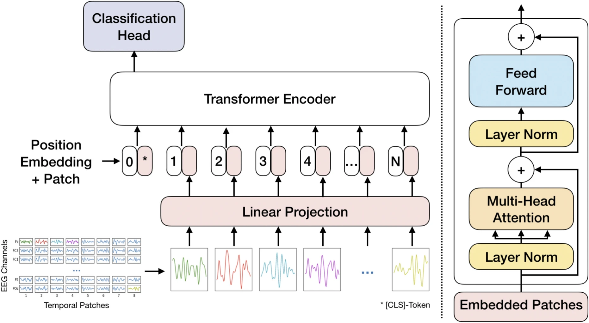

# Patched Brain Transformer



This repository contains the code for reproducing, or extending the Patched Brain Transformer from our paper: <br>
**Flexible Patched Brain Transformer model for EEG decoding**  

Timon Klein, Piotr Minakowski & Sebastian Sager <br>
Published in Scientific Reports, 2025 <br>
[Read the full paper](https://www.nature.com/articles/s41598-025-86294-3?)  
##

**Abstract:**

Decoding the human brain using non-invasive methods is a significant challenge. This study aims to enhance electroencephalography (EEG) decoding by developing of machine learning methods. Specifically, we propose the novel, attention-based Patched Brain Transformer model to achieve this goal. The model exhibits flexibility regarding the number of EEG channels and recording duration, enabling effective pre-training across diverse datasets. We investigate the effect of data augmentation methods and pre-training on the training process. To gain insights into the training behavior, we incorporate an inspection of the architecture. We compare our model with state-of-the-art models and demonstrate superior performance using only a fraction of the parameters. The results are achieved with supervised pre-training, coupled with time shifts as data augmentation for multi-participant classification on motor imagery datasets.


**Usage:**

For unsupervised pre-training, run main_pre_training.py with config['pre_train_bert'] =  True. <br>
For supervised pre-training, run main_pre_training.py with config['pre_train_bert'] =  False. <br>
To fine-tune the model, run main_fine_tune.py.

 
 **Citation:**
 ```bibtex
 @article{PatchedBrainTransformer,
  author    = {Timon Klein, Piotr Minakowski & Sebastian Sager},
  title     = {Flexible Patched Brain Transformer model for EEG decoding},
  journal   = {Scientific Reports},
  year      = {2025},
  doi       = {10.1038/s41598-025-86294-3},
  url       = {https://doi.org/10.1038/s41598-025-86294-3}
}
```


**License:**

This code is licensed under the MIT License. See LICENSE for details.
